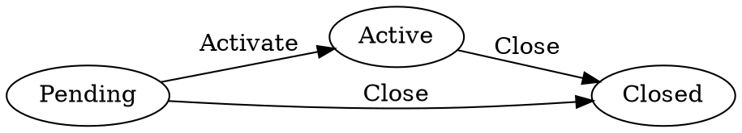

# machina

[](https://pkg.go.dev/github.com/renaldid/machina)
[](https://golang.org/dl/)
[](LICENSE)
[](https://github.com/renaldid/machina)

**machina** is a type-safe finite state machine for Go, built on generics.

It improves on [looplab/fsm](https://github.com/looplab/fsm) — the most popular Go FSM library — by replacing stringly-typed states and events with any comparable type, catching invalid usage at compile time instead of at runtime.

```go
// looplab/fsm — states and events are plain strings, errors surface at runtime
fsm.NewFSM("idle", fsm.Events{
    {Name: "start", Src: []string{"idle"}, Dst: "running"},
}, ...)

// machina — states and events are typed, invalid usage is a compile error
machina.New[State, Event](Idle,
    machina.T(Idle, Start, Running),
)
```

---

## Install

```bash
go get github.com/renaldid/machina
```

Zero dependencies.

---

## Quick start

```go
package main

import (
    "context"
    "fmt"
    "github.com/renaldid/machina"
)

type State int

const (
    Pending State = iota
    Active
    Closed
)

type Event int

const (
    Activate Event = iota
    Close
)

func main() {
    m := machina.New[State, Event](Pending,
        machina.T(Pending, Activate, Active),
        machina.T(Active,  Close,    Closed),
        machina.T(Pending, Close,    Closed),
    )

    ctx := context.Background()
    _ = m.Send(ctx, Activate)
    fmt.Println(m.State()) // Active

    _ = m.Send(ctx, Close)
    fmt.Println(m.State()) // Closed
}
```

---

## API

### Creating an FSM

```go
m := machina.New[S, E](initialState, opts...)
```

`S` and `E` can be any comparable type: `int`, `string`, a custom `type State int`, etc.

### Registering transitions

```go
// T: unconditional transition
machina.T(from, event, to)

// TG: guarded transition — proceeds only when guard returns true
machina.TG(from, event, to, func(ctx context.Context) bool {
    return isAuthorized(ctx)
})
```

`New` panics if you register two transitions for the same `(from, event)` pair — this is always a programmer error caught at startup, not at runtime.

### Querying state

```go
m.State()     // current state
m.Can(event)  // true if event is valid from current state
m.States()    // all states with outgoing transitions (order not guaranteed)
```

### Sending events

```go
err := m.Send(ctx, event)
```

`Send` is safe for concurrent use. Returns:

| Error | Meaning |
|---|---|
| `nil` | Transition succeeded |
| `machina.ErrInvalidTransition` | No transition registered for `(currentState, event)` |
| `machina.ErrGuardRejected` | Guard returned `false` |
| any other error | Returned by a hook |

Use `errors.Is` to check:

```go
if errors.Is(err, machina.ErrInvalidTransition) { ... }
if errors.Is(err, machina.ErrGuardRejected) { ... }
```

### Hooks

```go
// Called when leaving a state. If it returns error, transition is aborted.
machina.OnExit(state, func(ctx context.Context, event E) error { ... })

// Called after entering a state. State has already changed.
machina.OnEnter(state, func(ctx context.Context, event E) error { ... })

// Called after every successful transition.
machina.OnTransition(func(ctx context.Context, from S, event E, to S) error { ... })
```

Multiple hooks on the same state are called in registration order.

> **Note:** hooks must not call FSM methods — `Send` holds the write lock for the full transition; calling it from a hook will deadlock.

### Visualization

```go
fmt.Println(m.DOT())
```

Outputs [Graphviz DOT](https://graphviz.org/) notation:



Render: `dot -Tpng graph.dot -o graph.png`

---

## Full example: order workflow

```go
type OrderState int
const (
    Pending  OrderState = iota
    Paid
    Shipped
    Delivered
    Cancelled
)

type OrderEvent int
const (
    PaymentReceived OrderEvent = iota
    ItemShipped
    ItemDelivered
    CancelOrder
)

m := machina.New[OrderState, OrderEvent](Pending,
    machina.T(Pending, PaymentReceived, Paid),
    machina.T(Paid,    ItemShipped,     Shipped),
    machina.T(Shipped, ItemDelivered,   Delivered),
    machina.TG(Pending, CancelOrder, Cancelled, func(ctx context.Context) bool {
        return isAdmin(ctx)
    }),
    machina.TG(Paid, CancelOrder, Cancelled, func(ctx context.Context) bool {
        return isAdmin(ctx)
    }),

    machina.OnEnter[OrderState, OrderEvent](Shipped, func(ctx context.Context, e OrderEvent) error {
        return sendShippingNotification(ctx)
    }),
    machina.OnTransition[OrderState, OrderEvent](func(ctx context.Context, from OrderState, e OrderEvent, to OrderState) error {
        return auditLog(ctx, from, e, to)
    }),
)
```

---

## Why machina over looplab/fsm?

| | looplab/fsm | machina |
|---|---|---|
| State/event types | `string` | any `comparable` |
| Invalid transition detection | runtime | compile error + typed sentinel |
| Duplicate transition | silent overwrite | `panic` at startup |
| Guard functions | ✓ | ✓ |
| Entry/exit hooks | ✓ | ✓ |
| Context propagation | partial | ✓ all hooks |
| DOT export | ✓ | ✓ |
| Thread-safe | ✓ | ✓ |
| Dependencies | 0 | 0 |
| Go generics | ✗ | ✓ |
| Last release | 2021 | active |

---

## License

[MIT](LICENSE)

<!-- SEO: golang finite state machine, go fsm generics, type-safe state machine go, golang state machine library, looplab/fsm alternative generics, go typed fsm, golang state transitions generics, machina fsm go, go 1.22 state machine, finite automata golang -->
